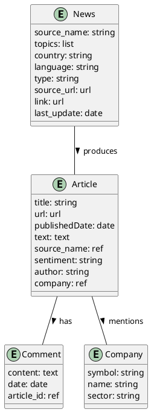

# AINewsTracker: An Overview

## Introduction

AINewsTracker is a platform that manages a wide range of data types such as news sources, articles, comments, and company information. These data are interconnected, providing rich context and insights. Below is a simplified overview of these data types and how they interact.

## Data Types

### 1. News Source

This is an example of how a news source might be represented.

```json
{
    'source_name': 'The AI Journal',
    'topics': ['AI', 'ML'],
    'country': 'US',
    'language': 'EN',
    'type': 'Online',
    'source_url': 'https://theaijournal.com',
    'link': 'https://theaijournal.com/latest-news',
    'last_update': '2023-06-24',
}
```

### 2. Article

Articles are linked to their respective news source. The example below shows a representation of an article that originates from the news source example above.

```json
{
    'title': 'Latest AI Advancements',
    'url': 'https://theaijournal.com/latest-ai-advancements',
    'publishedDate': '2023-06-24',
    'text': 'This article discusses the latest advancements in AI...',
    'source_name': 'The AI Journal',  // Derived from the `source_name` field in the news source.
    'sentiment': 'Positive',
    'author': 'John Doe',
    'company': 'Google Inc.',
}
```

### 3. Comment

Comments are linked to their respective articles. Here's an example:

```json
{
    'content': 'Great article!',
    'date': '2023-06-24',
    'article_id': 'https://theaijournal.com/latest-ai-advancements',  // Linked to the article via the `url` field.
}
```

### 4. Company

Companies are linked to articles that mention them. Here's an example:

```json
{
    'symbol': 'GOOG',
    'name': 'Google Inc.',
    'sector': 'Technology',
}
```

## Data Relations Diagram

Here's a simple PlantUML diagram illustrating the relationships between these entities:



## NLP Operations

Using Natural Language Processing, AINewsTracker can perform operations such as sentiment analysis and ticker detection on articles. Here are examples of how these operations might be represented:

### Sentiment Analysis

```json
{
    'title': 'Latest AI Advancements',
    'url': 'https://theaijournal.com/latest-ai-advancements',
    'sentiment_score': 0.8,  // The sentiment score of the article text.
    'sentiment': 'Positive',  // The sentiment of the article, determined based on the sentiment score.
}
```
### Ticker Detection

```json
{
    'title': 'Latest AI Advancements',
    'url': 'https://theaijournal.com/latest-ai-advancements',
    'tickers': ['GOOG'],  // The ticker symbols found in the article text.
}
```
## Summary Extraction

Another essential feature offered by AINewsTracker is the capability to extract summary information from an article using NLP techniques. This can be beneficial for users who need to understand the gist of an article quickly. Here's an example of how the summary extraction for an article might be represented:

```json
{
    'title': 'Latest AI Advancements',
    'url': 'https://theaijournal.com/latest-ai-advancements',
    'summary': 'This article discusses the latest advancements in AI, highlighting major breakthroughs made by Google Inc...',
}
```
In this example, the 'summary' field contains a concise overview of the article's content, providing quick insight into the article's main points. This brief overview is generated using advanced NLP techniques that identify and summarize the most critical information from the article text.

Please note that the quality and accuracy of the summary can depend on various factors, including the complexity of the article's content and the efficiency of the NLP algorithm used for summary extraction.

## Topic Classification

Topic classification is a crucial NLP operation where we determine the topics that an article discusses. This can help categorize the articles for easier access and understand the main areas covered in the text. Here's an example of how the topic classification for an article might be represented:

```json
{
    'title': 'Latest AI Advancements',
    'url': 'https://theaijournal.com/latest-ai-advancements',
    'topics': ['AI', 'Machine Learning', 'Google'],  // The main topics found in the article text.
}
```

In this example, the 'topics' field contains a list of the main subjects that the article discusses. The topic classification is conducted using sophisticated NLP techniques, which examine the text and identify key themes.

## Note

These examples provide a basic understanding of the data types and operations in AINewsTracker. The actual data structures may be more complex and contain additional fields. For detailed definitions, please refer to the Pydantic model classes (`News`, `Article`, `Comment`, `Company`) in the AINewsTracker codebase.